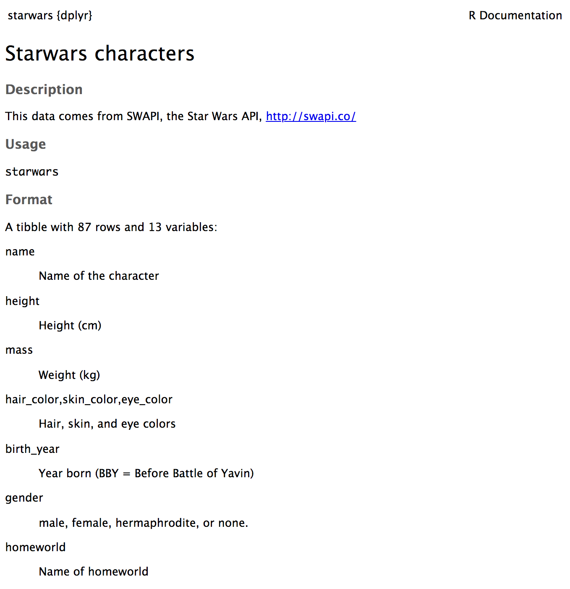
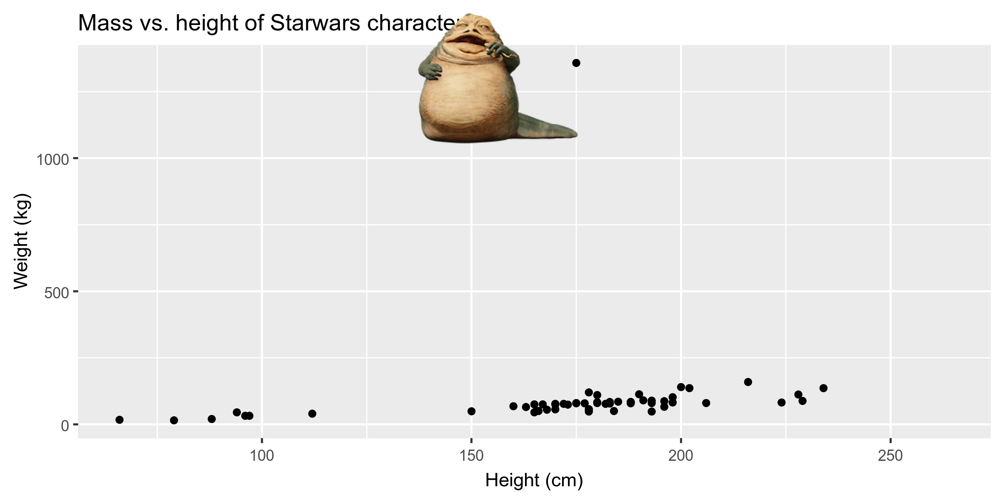

```{r child = "../setup.Rmd"}
```

```{r packages, echo=FALSE, message=FALSE, warning=FALSE}
library(emo)
library(tidyverse)
library(fontawesome)
library(magick)
library(Tmisc)
library(dsbox)
```

class: middle

# Análise exploratória de dados


---
class: left

## O que é Análise exploratória de dados?

- A análise exploratória de dados (EDA) é uma abordagem para analisar conjuntos de dados para resumir suas principais características.
- Muitas vezes, isso é visual. É nisso que estamos nos concentrando hoje.
- Mas também podemos calcular estatísticas sumárias e realizar o _data wrangling_ (manipulação/transformação de dados) nesta fase (ou antes) desta fase da análise. É nisso que vamos nos concentrar.

---

class: middle

# Visualização de Dados

---

## Visualização de Dados

> *"O gráfico simples trouxe mais informações à mente do analista de dados do que qualquer outro dispositivo." — John Tukey*


- Visualização de dados é a criação e estudo da representação visual dos dados.
- Existem muitas ferramentas para visualizar dados (R é uma delas), e muitas abordagens/sistemas dentro de R para fazer visualizações de dados(**ggplot2** é uma delas, e é isso que vamos usar).

---

## ggplot2 $\in$ tidyverse

.pull-left[
```{r echo=FALSE, out.width="80%"}
knitr::include_graphics("img/ggplot2-part-of-tidyverse.png")
```
]
.pull-right[
- **ggplot2** é o pacote de visualização de dados do tidyverse;
- O `gg` em "ggplot2" significa Gramática de Gráficos;
- É inspirado no livro **Grammar of Graphics** de _Leland Wilkinson_
]
---

## Gramática dos Gráficos

A gramática de gráficos é uma ferramenta/técnica que nos permite descrever concisamente os componentes de um gráfico:

```{r echo=FALSE, out.width="70%"}
knitr::include_graphics("img/grammar-of-graphics.png")
```

.footnote[ 
Source: [BloggoType](http://bloggotype.blogspot.com/2016/08/holiday-notes2-grammar-of-graphics.html)
]

---

```{r out.width="70%"}
ggplot(data = starwars, mapping = aes(x = height, y = mass)) +
  geom_point() +
  labs(title = "Mass vs. height of Starwars characters",
       x = "Height (cm)", y = "Weight (kg)")
```

---

.discussion[
- Quais são as funções que estão fazendo o gráfico? 
- Qual é o conjunto de dados que está sendo usado? 
- Qual variável está no eixo **x**, e qual variável está no eixo **y**? 
- O que significa o aviso?
]

```{r eval=FALSE}
ggplot(data = starwars, mapping = aes(x = height, y = mass)) +
  geom_point() +
  labs(
    title = "Mass vs. height of Starwars characters",
    x = "Height (cm)", 
    y = "Weight (kg)"
    )
```

```
## Warning: Removed 28 rows containing missing values (geom_point).
```

---

.discussion[
O que `geom_smooth()` faz?
]

```{r out.width="70%", warning=FALSE, message=FALSE}
ggplot(data = starwars, mapping = aes(x = height, y = mass)) +
  geom_point() +
  geom_smooth() + #<<
  labs(title = "Mass vs. height of Starwars characters",
       x = "Height (cm)", y = "Weight (kg)")
```

---

## Hello ggplot2!

- `ggplot()` é a principal função em ggplot2 
- Os gráficos são construídas em camadas
- Estrutura do código para gráficos pode ser resumida como:
```{r eval = FALSE}
ggplot(data = [dataset], 
       mapping = aes(x = [x-variable], y = [y-variable])) +
   geom_xxx() +
   other options
```
- Para usar as funções do ggplot2, primeiramente carregue o tidyverse
```{r}
library(tidyverse)
```
- Para obter ajuda com o ggplot2, consulte [ggplot2.tidyverse.org](http://ggplot2.tidyverse.org/)

---

class: middle

# Visualizando os dados de Star Wars

---

## Terminologia do conjunto de dados

- Cada linha é uma **observação**
- Cada coluna é uma **variável**

.small[
```{r message=FALSE}
starwars
```
]

---

## Luke Skywalker


---

## O que há nos dados de Star Wars?

Veja os dados usando a função `glimpse`: 

```{r}
glimpse(starwars)
```

---

## O que há nos dados de Star Wars?

.discussion[
Quantas linhas e colunas esse conjunto de dados tem? O que cada linha representa? O que cada coluna representa?
]

```{r eval = FALSE}
?starwars
```

```{r echo=FALSE}

```

---

## Mass vs. height

```{r out.width="70%"}
ggplot(data = starwars, mapping = aes(x = height, y = mass)) +
  geom_point()
```

---

## Que aviso é esse?

- Nem todos os personagens têm informações de altura e massa (portanto, 28 deles não plotados)

```
## Warning: Removed 28 rows containing missing values (geom_point).
```

- Daqui para frente eu vou suprimir o aviso para economizar espaço em slides, mas é importante notá-lo

---

## Labels (Rótulos)

.small[
```{r out.width="70%", warning=FALSE}
ggplot(data = starwars, mapping = aes(x = height, y = mass)) +
  geom_point() +
  labs(title = "Mass vs. height of Starwars characters", #<<
       x = "Height (cm)", y = "Weight (kg)")             #<<
```
]

---

## Mass vs. height

.discussion[
Como descreveria essa relação? Que outras variáveis nos ajudariam a entender os pontos de dados que não seguem a tendência geral? Quem não é o personagem não tão alto, mas realmente gordinho?
]

.small[
```{r out.width="70%", warning=FALSE,echo=FALSE}
ggplot(data = starwars, mapping = aes(x = height, y = mass)) +
  geom_point() +
  labs(title = "Mass vs. height of Starwars characters",
       x = "Height (cm)", y = "Weight (kg)")
```
]

---

## Jabba!

```{r echo=FALSE, warning=FALSE, cache=TRUE}
jabba <- image_read("img/jabba.png")

fig <- image_graph(width = 2400, height = 1200, res = 300)
ggplot(data = starwars, mapping = aes(x = height, y = mass)) +
  geom_point(size = 1.5) + 
  labs(title = "Mass vs. height of Starwars characters",
       x = "Height (cm)", y = "Weight (kg)")
dev.off()

out <- fig %>% image_composite(jabba, offset = "+1000+30")

image_write(out, "img/jabbaplot.png", format = "png")

```

---

## Variáveis adicionais

Podemos mapear variáveis adicionais para várias características do gráfico:

- aesthetics (estética)
    - shape
    - colour
    - size
    - alpha (transparência)
- faceting: exibindo múltiplos subconjuntos diferentes

---

class: middle

# Aesthetics (Estética)

---

## Opções de estética

Características visuais de plotagem de caracteres que podem ser **mapeados para uma variável específica**
nos dados, que são:

- `color`
- `size`
- `shape`
- `alpha` (transparência)

---

## Mass vs. height + gender

```{r out.width="70%", warning=FALSE}
ggplot(data = starwars, 
       mapping = aes(x = height, y = mass, color = gender)) +
  geom_point()
```

---

## Mass vs. height + gender

```{r out.width="70%", warning=FALSE}
ggplot(data = starwars, 
       mapping = aes(x = height, y = mass, color = gender, 
                     size = birth_year)) + #<<
  geom_point()
```

---

## Mass vs. height + gender

Vamos agora aumentar o tamanho de todos os pontos, mas **não** com base nos valores de uma variável nos dados:

```{r out.width="70%", warning=FALSE}
ggplot(data = starwars, mapping = aes(x = height, y = mass, color = gender)) +
  geom_point(size = 2) #<<
```

---

## Resumo estético

- A variável contínua é medida em escala contínua
- Variáveis discretas são medidas (ou muitas vezes contadas) em uma escala discreta

aesthetics    | discrete                 | continuous
------------- | ------------------------ | ------------
color         | arco-íris de cores       | gradiente
size          | passos discretos         | mapeamento linear entre raio e valor
shape         |	forma diferente para cada | não deve (e não) usar

- Use a estética para mapear características de um plot para uma variável, defina os recursos no geom para personalização **não** mapeada a uma variável

---

class: middle

# Faceting

---

## Faceting

- Gráficos menores que exibem diferentes subconjuntos dos dados
- Útil para explorar relações condicionais e grandes dados
- Útil para explorar o comportamento de diferentes variáveis

---

```{r out.width="80%", warning=FALSE}
ggplot(data = starwars, mapping = aes(x = height, y = mass)) +
  facet_grid(. ~ gender) + #<<
  geom_point() +
  labs(title = "Mass vs. height of Starwars characters",
       subtitle = "Faceted by gender")  #<<
```

---

## Mergulhe mais...

.discussion[
Nos próximos slides, descreva o que cada parcela exibe. Pense em como o código se relaciona com a saída.
]

--

<br><br><br>

.alert[
Os gráficos nos próximos slides não têm títulos próprios, rótulos de eixo, etc. porque quero que vocês descubram o que está acontecendo nos plots. Mas você deve sempre rotular seus gráficos!
]

---

```{r out.width="80%", warning=FALSE}
ggplot(data = starwars, mapping = aes(x = height, y = mass)) +
  geom_point() +
  facet_grid(gender ~ .)
```

---

```{r out.width="80%", warning=FALSE}
ggplot(data = starwars, mapping = aes(x = height, y = mass)) +
  geom_point() +
  facet_grid(. ~ gender)
```

---

```{r out.width="80%", warning=FALSE}
ggplot(data = starwars, mapping = aes(x = height, y = mass)) +
  geom_point() +
  facet_wrap(~ eye_color)
```

---

## Resumo do Facet

- `facet_grid()`: 
    - 2d grid
    - `rows ~ cols`
    - use `.` caso não queira fazer divisão   
- `facet_wrap()`: fita 1d embrulhada em 2d

---

class: middle

# Identificando variáveis

---

## Número de variáveis envolvidas

* Análise de dados univariados - distribuição de variável única
* Análise de dados bivariais - relação entre duas variáveis
* Análise de dados multivariadas - relação entre muitas variáveis ao mesmo tempo, geralmente focando na relação entre dois enquanto condicionamento para outros

---

## Tipos de variáveis

- **Variáveis numéricas** podem ser classificadas como **contínuas** ou **discretas** com base em se a variável pode ou não assumir um número infinito de valores ou apenas números inteiros não negativos, respectivamente. 
- Se a variável for **categórica**, podemos determinar se é **ordinal** com base em: se os níveis têm ou não uma ordem natural.

---

class: middle

# Visualizando dados numéricos

---

## Descrevendo formas de distribuições numéricas

* formato:
    * distorção (skewness):  inclinada para a direita, inclinada para a esquerda, simétrica (a inclinação é para o lado da cauda mais longa)
    * modalidade: unimodal, bimodal, multimodal, uniforme
* centro/central: média (`mean`), mediana (`median`), moda (nem sempre útil)
* Espalhar/Disperção (spread): intervalo (`range`), desvio padrão (`sd`), alcance/intervalor interquartil (`IQR`)


---

## Histogramas

```{r out.width="75%"}
ggplot(data = starwars, mapping = aes(x = height)) +
  geom_histogram(binwidth = 10)
```

---

## Plots de densidade

```{r out.width="75%"}
ggplot(data = starwars, mapping = aes(x = height)) +
  geom_density()
```

---

## Box plots (gráfico de caixa) lado a lado

```{r out.width="75%"}
ggplot(data = starwars, mapping = aes(y = height, x = gender)) +
  geom_boxplot()
```

---

## Ridge plots (cumes)

```{r out.width="70%"}
library(ggridges)
ggplot(starwars, aes(x = height, y = gender, fill = gender, color = gender)) + 
  geom_density_ridges(alpha = 0.5)
```

---

class: middle

# Visualizando dados categóricos

---

## Gráficos de barras

```{r out.width="80%"}
ggplot(data = starwars, mapping = aes(x = gender)) +
  geom_bar()
```

---

## Gráfico de barras segmentado, contagem

```{r out.width="80%"}
ggplot(data = starwars, mapping = aes(x = gender, fill = hair_color)) +
  geom_bar()
```

---

## dplyr::mutate(hair_color)

```{r}
starwars <- starwars %>%
  mutate(hair_color2 = 
           fct_other(hair_color, 
                     keep = c("black", "brown", "blond")
                     )
         )
```

---

## Gráfico de barras segmentado, contagem

```{r out.width="70%", fig.asp = 0.5}
ggplot(data = starwars, 
       mapping = aes(x = gender, fill = hair_color2)) +
  geom_bar() +
  coord_flip()
```

---

## Gráfico de barras segmentado, proporções

```{r out.width="70%", fig.asp = 0.5}
ggplot(data = starwars, 
       mapping = aes(x = gender, fill = hair_color2)) +
  geom_bar(position = "fill") +
  coord_flip()
  labs(y = "proportion")
```

---

.discussion[
Qual gráfico de barra é uma representação mais útil para visualizar a relação entre gênero e cor do cabelo?
]

.pull-left[
```{r echo=FALSE, out.width="100%"}
ggplot(data = starwars, mapping = aes(x = gender, fill = hair_color2)) +
  geom_bar() +
  coord_flip()
```
]
.pull-right[
```{r echo=FALSE, out.width="100%"}
ggplot(data = starwars, mapping = aes(x = gender, fill = hair_color2)) +
  geom_bar(position = "fill") +
  coord_flip() +
  labs(y = "proportion")
```
]

---

## Gráfico de disperção (Scatter plot)...

Esta não é uma melhor representação desses dados.

```{r out.width="60%", warning=FALSE}
ggplot(data = starwars, mapping = aes(y = height, x = gender)) +
  geom_point()
```

---

## Gráficos de Violino

```{r out.width="75%", warning=FALSE}
ggplot(data = starwars, mapping = aes(y = height, x = gender)) +
  geom_violin()
```

---

## Jitter plot

```{r echo=FALSE}
set.seed(1234)
```


```{r out.width="75%", warning=FALSE}
ggplot(data = starwars, mapping = aes(y = height, x = gender)) +
  geom_jitter()
```


---

class: middle

# Por que visualizamos?   

---

## Dados: `datasaurus_dozen`

Abaixo está uma amostra do conjunto de dados: `datasaurus_dozen`

```{r datasaurus-view-wide, echo=FALSE}
library(datasauRus)
datasaurus_dozen_wide %>%
  select(1:8)
```

---

## Resumo Estatístico

.small[
```{r datasaurus-cor}
datasaurus_dozen %>%
  group_by(dataset) %>%
  summarise(r = cor(x, y))
```
]

---

## 

.discussion[
Quão semelhantes são as relações entre `x` e `y` nos treze conjuntos de dados? 
Quão semelhantes são baseados no resumo estatístico?
]

```{r datasaurus-plot, echo=FALSE}
ggplot(datasaurus_dozen, aes(x = x, y = y, color = dataset))+
  geom_point()+
  facet_wrap(~ dataset, ncol = 5) +
  theme(legend.position = "none")
```

---

## Quarteto de Anscombe

```{r quartet-for-show, eval=FALSE}
library(Tmisc)
quartet
```

.pull-left[
```{r quartet-view1, echo=FALSE}
quartet[1:22,]
```
]
.pull-right[
```{r quartet-view2, echo=FALSE}
quartet[23:44,]
```
]

---

## Resumindo o quarteto de Anscombe

```{r quartet-summary}
quartet %>%
  group_by(set) %>%
  summarise(
    mean_x = mean(x), 
    mean_y = mean(y),
    sd_x = sd(x),
    sd_y = sd(y),
    r = cor(x, y)
  )
```

---

## Visualizando o quarteto de Anscombe

```{r quartet-plot, out.width="75%"}
ggplot(quartet, aes(x = x, y = y)) +
  geom_point() +
  facet_wrap(~ set, ncol = 4)
```

---

## Idade no primeiro beijo

.discussion[
Você vê algo fora do comum?
]

```{r echo=FALSE, out.width="90%"}
ggplot(student_survey, aes(x = first_kiss)) +
  geom_histogram(binwidth = 1) +
  labs(title = "Quantos anos tinha quando teve seu primeiro beijo?")
```

---

## Visitas ao Facebook

.discussion[
Como as pessoas estão relatando valores mais baixos vs. mais altos de visitas do FB?
]

```{r echo=FALSE, out.width="90%"}
ggplot(student_survey, aes(x = fb_visits_per_day)) +
  geom_histogram(binwidth = 1) +
  labs(title = "Quantas vezes você acessa o Facebook por dia ?", x = "")
```

---

.your-turn[

Hora de realmente brincar com o conjunto de dados de Star Wars!

- Vá para RStudio Cloud  ([rstd.io/dsbox-cloud](http://rstd.io/dsbox-cloud)) e comece com  `AE 03 - StarWars + Data visualization`.
- Abra o documento R Markdown e complete o exercício.
]

```{r echo=FALSE}
countdown(minutes = 10)
```

