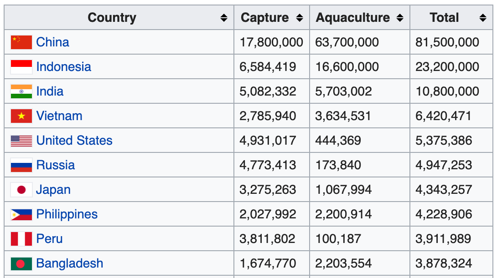
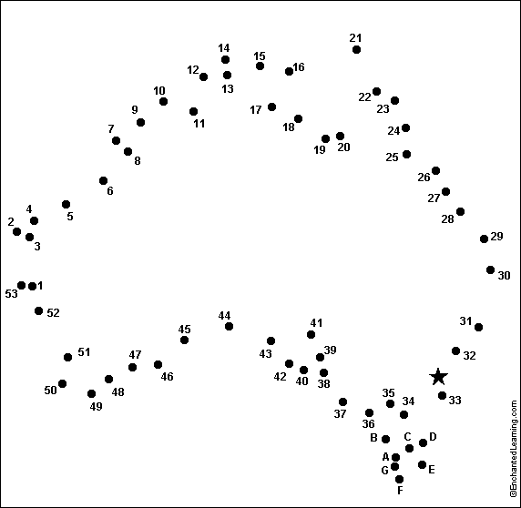

```{r child = "../setup.Rmd"}
```

```{r packages, echo=FALSE, message=FALSE, warning=FALSE}
library(tidyverse)
library(emo)
library(knitr)
library(skimr)
library(scales)
```

class: middle

# Trabalhando com vários data frames

---

class: middle

.hand[Você...]

.huge-blue[Têm] .hand[vários data frames]

.huge-pink[Quer] .hand[fatia-lo, corta-lo, espreme-lo, e processa-lo]

---

## Pesca do mundo

O Departamento de Pesca e Aquicultura da Organização das Nações Unidas para a Alimentação e a Agricultura coleta dados sobre a produção pesqueira dos países.

```{r echo=FALSE, out.width="60%", fig.align="center"}

```
.center[
.hand[...]
]

.footnote[
- Source: https://en.wikipedia.org/wiki/Fishing_industry_by_country
]

---

## Carregar dados

```{r}
fisheries <- read_csv("data/fisheries.csv")
```

---

## Primeira olhada nos dados

.xsmall[
```{r render = normal_print, echo=2}
options(width=140)
skim(fisheries)
```
]

---

## Resumindo algumas estatísticas

```{r}
fisheries %>%
  summarise(
    mean_cap = mean(capture),
    mean_aqc = mean(aquaculture),
    mean_tot = mean(total)
  )
```

--

<br>

.hand[
bem, isso foi chato...
]

---

## Uma nova abordagem!

```{r}
fisheries %>%
  summarise(across(capture:total, mean))
```

--

.hand[e uma vez que aprendemos mais sobre tipos de dados...]

```{r}
fisheries %>%
  summarise(across(is.numeric, mean))
```

---

.discussion[
A visualização (não tão grande) abaixo mostra a distribuição da colheita da pesca dos países para 2016, por captura e aquicultura. Quais são as maneiras de melhorar essa visualização? Note-se que países cuja colheita total foi inferior a 100.000 toneladas não estão incluídos na visualização.
]

```{r echo=FALSE, out.width="60%", fig.align="center"}
include_graphics("img/fisheries.png")
```

--

- Calcule as estatísticas resumidas no nível do continente e visualize-as.
- Mapeie os dados.

---

.huge-pink[objetivo:] 

.hand-blue[calcular estatísticas resumidas no nível do continente e visualizá-las]

---

## Preparação de dados

```{r message=FALSE}
continents <- read_csv("data/continents.csv")
```

Filtrar países cuja colheita total foi inferior a 100.000 toneladas, uma vez que não estão incluídos na visualização:

```{r}
fisheries <- fisheries %>%
  filter(total > 100000)

fisheries
```

---

class: middle

# Junção dos dados

---

.pull-left[
```{r}
fisheries %>% select(country)
```
]
.pull-right[
```{r}
continents
```
]

---

## Juntando data frames

```
something_join(x, y)
```

- `inner_join()`: todas as linhas de x onde há valores correspondentes em y, retornem toda a combinação de várias combinações no caso de houver várias linhas correspondentes
- `left_join()`: todas as linhas de x
- `right_join()`: todas as linhas de y
- `full_join()`: todas as linhas de x e y
- `semi_join()`: todas as linhas de x onde há valores correspondentes em y, mantendo apenas colunas de x.
- `anti_join()`: retornar todas as linhas de x onde não há valores correspondentes em y, nunca duplica linhas de x
- ...
 
---

## Setup

Para os próximos slides...

.pull-left[
```{r echo=FALSE}
x <- tibble(value = c(1, 2, 3))
```
```{r}
x
```
]
.pull-right[
```{r echo=FALSE}
y <- tibble(value = c(1, 2, 4))
```
```{r}
y
```
]

---

## `inner_join()`

.pull-left[
```{r}
inner_join(x, y)
```
]
.pull-right[
```{r echo=FALSE}
include_graphics("img/inner-join.gif")
```
]

---

## `left_join()`

.pull-left[
```{r}
left_join(x, y)
```
]
.pull-right[
```{r echo=FALSE}
include_graphics("img/left-join.gif")
```
]

---

## `right_join()`

.pull-left[
```{r}
right_join(x, y)
```
]
.pull-right[
```{r echo=FALSE}
include_graphics("img/right-join.gif")
```
]

---

## `full_join()`

.pull-left[
```{r}
full_join(x, y)
```
]
.pull-right[
```{r echo=FALSE}
include_graphics("img/full-join.gif")
```
]

---

## `semi_join()`

.pull-left[
```{r}
semi_join(x, y)
```
]
.pull-right[
```{r echo=FALSE}
include_graphics("img/semi-join.gif")
```
]

---

## `anti_join()`

.pull-left[
```{r}
anti_join(x, y)
```
]
.pull-right[
```{r echo=FALSE}
include_graphics("img/anti-join.gif")
```
]

---

.discussion[
Queremos manter todas as linhas e colunas de `fisheries` e adicionar uma coluna para continentes correspondentes. Qual função de adesão devemos usar?
]

.pull-left[
```{r}
fisheries %>% select(country)
```
]
.pull-right[
```{r}
continents
```
]

---

## Junte pescas e continentes 

```{r}
fisheries <- left_join(fisheries, continents) 
```

--

.discussion[
Como `left_join()` saberá juntar os dois data frames por `country`?
]

Hint:

- Variáveis no conjunto de dados da pesca original:

```{r echo=FALSE}
fisheries %>% select(-continent) %>% names()
```

- Variáveis no conjunto de dados dos continentes:

```{r echo=FALSE}
names(continents)
```


---

## Verifique os dados

```{r}
fisheries %>%
  filter(is.na(continent))
```

---

## Implementar correções

```{r}
fisheries <- fisheries %>%
  mutate(continent = case_when(
    country == "Democratic Republic of the Congo" ~ "Africa",
    country == "Hong Kong"                        ~ "Asia",
    country == "Myanmar"                          ~ "Asia",
    TRUE                                          ~ continent
    )
  )
```

... e verificar novamente

```{r include=FALSE}
options(width=90)
```


```{r}
fisheries %>%
  filter(is.na(continent))
```

---

.discussion[
O que faz o seguinte código?
]

```{r eval=FALSE}
fisheries %>%
  mutate(aquaculture_perc = aquaculture / total)
```


---

```{r include=FALSE}
fisheries <- fisheries %>%
  mutate(aquaculture_perc = aquaculture / total)

fisheries_summary_continent <- fisheries %>%
  group_by(continent) %>%
  summarise(
    min_ap  = min(aquaculture_perc),
    mean_ap = mean(aquaculture_perc),
    max_ap  = max(aquaculture_perc)
  )
```

## Visualize estatísticas de resumo do continente

```{r out.width="80%"}
ggplot(fisheries_summary_continent, aes(x = continent, y = mean_ap)) +
  geom_col()
```

---

## Melhorar a visualização

```{r out.width="80%"}
ggplot(fisheries_summary_continent, 
       aes(x = fct_reorder(continent, mean_ap), y = mean_ap)) + #<<
  geom_col()
```

---

## Melhore ainda mais a visualização

```{r eval=FALSE}
ggplot(fisheries_summary_continent, 
       aes(y = fct_reorder(continent, mean_ap), x = mean_ap)) +
  geom_col() +
  scale_x_continuous(labels = label_percent(accuracy = 1)) + #<<
  labs( #<<
    x = "",  #<<
    y = "",  #<<
    title = "Average share of aquaculture by continent",  #<<
    subtitle = "out of total fisheries harvest, 2016",  #<<
    caption = "Source: bit.ly/2VrawTt" #<<
  ) +  #<<
  theme_minimal() #<<
```

$\rightarrow$ Veja o próximo slide...

---

```{r echo=FALSE}
ggplot(fisheries_summary_continent, 
       aes(y = fct_reorder(continent, mean_ap), x = mean_ap)) +
  geom_col() +
  scale_x_continuous(labels = label_percent(accuracy = 1)) +
  labs(
    x = "", y = "",
    title = "Average share of aquaculture by continent",
    subtitle = "out of total fisheries harvest, 2016",
    caption = "Source: bit.ly/2VrawTt"
  ) +
  theme_minimal()
```

---


.huge-pink[objetivo:] 

.hand-blue[mapear dados de pesca no nível do país]

---

## Mapeando os dados da pesca

- Obtenha limites do país e armazene como um data frame
- Junte os data frames _fisheries_ e _country boundaries_
- Plot os dados de _country boundaries_, e preencha por dados de _fisheries harvest_ (colheita da pesca).

---

## `map_data()`

A função `map_data()` transforma os dados do pacote **maps** em um data frame, que seja adequado para criar o plot com o pacote ggplot2:

```{r eval=FALSE}
map_data("world")
```

```{r echo=FALSE}
map_data("world")[1:14,]
```

---

## Conecte os pontos

```{r echo=FALSE, out.width="50%", fig.align="center"}

```

---

## Algumas correções para uma melhor correspondência

.discussion[
O que faz o seguinte código?
]

```{r}
world_map <- map_data("world") %>%
  mutate(region = case_when(
    region == "UK"           ~ "United Kingdom",
    region == "USA"          ~ "United States",
    subregion == "Hong Kong" ~ "Hong Kong",
    TRUE                     ~ region
    )
  )
```

---

## Mapa do mundo

.midi[
```{r out.width="80%"}
ggplot(world_map, aes(x = long, y = lat, group = group)) +
  geom_polygon(fill = "gray") +
  theme_minimal()
```
]


---

## Juntar dados: _fisheries_ e _world map_

.pull-left[
```{r}
fisheries %>% select(country)
```
]
.pull-right[
```{r}
world_map %>% select(region)
```
]

---

## Juntar dados: _fisheries_ e _world map_

```{r}
fisheries_map <- left_join(fisheries, world_map, 
                           by = c("country" = "region")) #<<
```

```{r}
glimpse(fisheries_map)
```

---

## Mapeando os dados de _fisheries_

.midi[
```{r out.width="80%"}
ggplot(fisheries_map, mapping = aes(x = long, y = lat, group = group)) +
  geom_polygon(aes(fill = capture)) +
  scale_fill_viridis_c() +
  theme_minimal()
```
]

---

.discussion[
O que é enganoso sobre o seguinte mapa?
]

```{r echo=FALSE, out.width="80%"}
ggplot(fisheries_map, mapping = aes(x = long, y = lat, group = group)) +
  geom_polygon(aes(fill = capture)) +
  scale_fill_viridis_c() +
  theme_minimal()
```

---

## Colocando tudo junto

```{r eval=FALSE}
ggplot() +
  # layer 1
  geom_polygon(world_map, 
               mapping = aes(x = long, y = lat, group = group), 
               fill = "lightgray") + #<<
  # layer 2
  geom_polygon(fisheries_map, 
               mapping = aes(x = long, y = lat, group = group, 
                             fill = capture)) + #<<
  scale_fill_viridis_c() +
  theme_minimal() +
  theme(legend.position = "bottom") +
  labs(
    x = "", y = "",
    title = "Fisheries harvest by capture, 2016",
    subtitle = "Capture measured in tonnes",
    caption = "Source: bit.ly/2VrawTt"
  )
```

---

```{r echo=FALSE, out.width="80%", fig.asp=0.75}
ggplot() +
  geom_polygon(world_map, 
               mapping = aes(x = long, y = lat, group = group), 
               fill = "lightgray") +
  geom_polygon(fisheries_map, 
               mapping = aes(x = long, y = lat, group = group, 
                             fill = capture)) +
  scale_fill_viridis_c() +
  theme_minimal() +
  theme(legend.position = "bottom") +
  labs(
    x = "", y = "",
    title = "Fisheries harvest by capture, 2016",
    subtitle = "Capture measured in tonnes",
    caption = "Source: bit.ly/2VrawTt"
  )
```

---

## Escala de log

```{r eval=FALSE}
ggplot() +
  geom_polygon(world_map, 
               mapping = aes(x = long, y = lat, group = group), 
               fill = "lightgray") +
  geom_polygon(fisheries_map, 
               mapping = aes(x = long, y = lat, group = group, 
                                            fill = log(capture))) + #<<
  scale_fill_viridis_c() +
  theme_minimal() +
  theme(legend.position = "bottom") +
  labs(
    x = "", y = "",
    title = "Fisheries harvest by capture, 2016",
    subtitle = "Capture measured in logged tonnes",
    caption = "Source: bit.ly/2VrawTt"
  )
```

---

```{r echo=FALSE, out.width="80%", fig.asp=0.75}
ggplot() +
  geom_polygon(world_map, mapping = aes(x = long, y = lat, group = group), fill = "lightgray") +
  geom_polygon(fisheries_map, mapping = aes(x = long, y = lat, group = group, fill = log(capture))) +
  scale_fill_viridis_c() +
  theme_minimal() +
  theme(legend.position = "bottom") +
  labs(
    x = "", y = "",
    title = "Fisheries harvest by capture, 2016",
    subtitle = "Capture measured in logged tonnes",
    caption = "Source: bit.ly/2VrawTt"
  )
```

---

## Aquicultura

```{r eval=FALSE}
ggplot() +
  geom_polygon(world_map, 
               mapping = aes(x = long, y = lat, group = group), 
               fill = "lightgray") +
  geom_polygon(fisheries_map, 
               mapping = aes(x = long, y = lat, group = group, 
                             fill = log(aquaculture+1))) + #<<
  scale_fill_viridis_c() +
  theme_minimal() +
  theme(legend.position = "bottom") +
  labs(
    x = "", y = "",
    title = "Fisheries harvest by aquaculture, 2016",
    subtitle = "Aquaculture measured in logged tonnes",
    fill = "log(aquaculture)",
    caption = "Source: bit.ly/2VrawTt"
  )
```

---

```{r echo=FALSE, out.width="80%", fig.asp=0.75}
ggplot() +
  geom_polygon(world_map, mapping = aes(x = long, y = lat, group = group), fill = "lightgray") +
  geom_polygon(fisheries_map, mapping = aes(x = long, y = lat, group = group, fill = log(aquaculture+1))) +
  scale_fill_viridis_c() +
  theme_minimal() +
  theme(legend.position = "bottom") +
  labs(
    x = "", y = "",
    title = "Fisheries harvest by aquaculture, 2016",
    subtitle = "Aquaculture measured in logged tonnes",
    fill = "log(aquaculture)",
    caption = "Source: bit.ly/2VrawTt"
  )
```

---

```{r echo=FALSE, out.width="80%", fig.asp=0.75}
fisheries_map <- fisheries_map %>%
  mutate(
    aquaculture_perc = aquaculture / total
  )

ggplot() +
  geom_polygon(world_map, 
               mapping = aes(x = long, y = lat, group = group), 
               fill = "lightgray") +
  geom_polygon(fisheries_map, 
               mapping = aes(x = long, y = lat, group = group, 
                             fill = aquaculture_perc)) +
  scale_fill_viridis_c(labels = label_percent(accuracy = 1)) +
  theme_minimal() +
  theme(legend.position = "bottom", legend.key.width = unit(2, "lines")) +
  labs(
    x = "", y = "",
    title = "Average share of aquaculture by country",
    subtitle = "out of total fisheries harvest, 2016",
    caption = "Source: bit.ly/2VrawTt",
    fill = "Aquaculture %"
  )
```


---

.your-turn[
- [RStudio Cloud](http://rstd.io/dsbox-cloud) > `AE 05 - Fisheries + Data joins` > Abra `fisheries.Rmd` e _knit_.
- _Knit_ o documento e trabalhe no Exercício 1.
]

```{r echo=FALSE}
countdown(minutes = 5)
```

---

.your-turn[
- [RStudio Cloud](http://rstd.io/dsbox-cloud) > `AE 05 - Fisheries + Data joins` > Abra `fisheries.Rmd` e _knit_.
- _Knit_ o documento e trabalhe nos Exercícios 2 -4.
]

```{r echo=FALSE}
countdown(minutes = 15)
```
