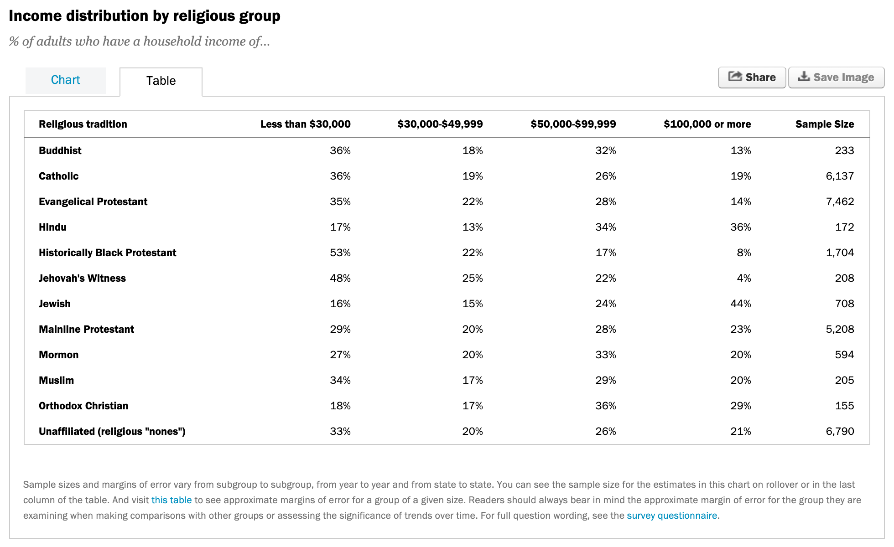

```{r child = "../setup.Rmd"}
```

```{r packages, echo=FALSE, message=FALSE, warning=FALSE}
library(tidyverse)
library(emo)
library(knitr)
library(skimr)
library(scales)
library(patchwork)
```

## A gramática dos dados arrumados (tidy)

.pull-left[
```{r dplyr-part-of-tidyverse, echo=FALSE, out.width="70%", fig.align = "center", caption = "dplyr is part of the tidyverse"}
include_graphics("img/tidyr-part-of-tidyverse.png")
```
]
.pull-right[
O objetivo do _tidyr_ é ajuda-lo a criar dados arrumados (tidy)
]

---

class: middle

# Tendências de emprego nas equipes de ensino

---

A Associação Americana de Professores Universitários (AAUP) é uma associação sem fins lucrativos de professores e outros profissionais acadêmicos. 
[Este relatório](https://www.aaup.org/sites/default/files/files/AAUP_Report_InstrStaff-75-11_apr2013.pdf) 
da AAUP mostra tendências nos funcionários da equipe de instrução entre 1975 e 2011, e contém uma imagem muito semelhante à da dada abaixo.

```{r echo=FALSE,out.width="70%",fig.align="center"}
include_graphics("img/staff-employment.png")
```

---

## Os dados

Cada linha neste conjunto de dados representa um tipo de corpo docente, e as colunas são os anos para os quais temos dados. Os valores são percentuais de contratações desse tipo de faculdade para cada ano.

```{r load-data-staff, message=FALSE}
staff <- read_csv("data/instructional-staff.csv")
staff
```

---

## Recriar a visualização

Para recriar essa visualização, precisamos primeiro remodelar os dados para ter uma variável para o tipo de corpo docente e uma variável para o ano. Em outras palavras, vamos converter os dados do formato longo ( _long_ ) para o formato amplo ( _wide_ ). 

Mas antes disso... 

.discussion[
Se os dados longos terão uma linha para cada combinação tipo ano/corpo docente, e há 5 tipos de professores e 11 anos de dados, quantas linhas os dados terão?
]

---

class: middle

```{r echo=FALSE,out.width="80%",fig.align="center"}
include_graphics("img/pivot.gif")
```

---

## Funções `pivot_*()`


```{r echo=FALSE, out.width="50%"}
include_graphics("img/tidyr-longer-wider.gif")
```

---

## `pivot_longer()`

```{r eval=FALSE}
pivot_longer(data, cols, names_to = "name", values_to = "value")
```

- O primeiro argumento são os `dados` como usual.

--

- O segundo argumento, `cols`, é onde você especifica quais colunas para pivotar em formato mais longo -- neste caso todas as colunas, exceto para o `faculty_type` 

--

- O terceiro argumento, `names_to`, é uma sequência especificando o nome da coluna para criar a partir dos dados armazenados nos nomes das colunas de dados -- neste caso `year`
--

- O quarto argumento, `values_to`, é uma sequência especificando o nome da coluna para criar a partir dos dados armazenados em valores de célula, neste caso `percentage`

---

## "Pivotando" os dados

```{r}
staff %>%
  pivot_longer(
    cols = -faculty_type, 
    names_to = "year", 
    values_to = "percentage"
    )
```

---

## "Pivotando" os dados, e salvando os resultados

```{r}
staff_long <- staff %>%
  pivot_longer(
    cols = -faculty_type, 
    names_to = "year", 
    values_to = "percentage"
    )

staff_long
```

---

.discussion[
Isso não parece certo, como você consertaria isso?
]

```{r out.width="70%"}
staff_long %>%
  ggplot(aes(x = percentage, y = year, color = faculty_type)) +
  geom_col(position = "dodge")
```

---

```{r out.width="80%"}
staff_long %>%
  ggplot(aes(x = percentage, y = year, fill = faculty_type)) +
  geom_col(position = "dodge")
```

---

## Alguma melhoria...

```{r out.width="80%"}
staff_long %>%
  ggplot(aes(x = percentage, y = year, fill = faculty_type)) +
  geom_col()
```

---

## Mais melhorias

```{r out.width="80%"}
staff_long %>%
  ggplot(aes(x = year, y = percentage, group = faculty_type, color = faculty_type)) +
  geom_line()
```

---

.discussion[
Qual é a diferença entre esses dois plots?
]

```{r echo=FALSE, out.width="70%", fig.asp=0.7}
p1 <- staff_long %>%
  ggplot(aes(x = year, y = percentage, group = faculty_type, color = faculty_type)) +
  geom_line() +
  guides(color = FALSE)
p2 <- staff_long %>%
  mutate(year = as.numeric(year)) %>%
  ggplot(aes(x = year, y = percentage, group = faculty_type, color = faculty_type)) +
  geom_line() +
  guides(color = FALSE)
p1 + p2 + 
  plot_layout(nrow = 2)
```

---

## Faça a variável year como numérica novamente!

```{r out.width="70%"}
staff_long <- staff_long %>%
  mutate(year = as.numeric(year))

staff_long %>%
  ggplot(aes(x = year, y = percentage, group = faculty_type, color = faculty_type)) +
  geom_line()
```

---

.discussion[
Como você faria para criar o seguinte plot?
]

```{r echo=FALSE, out.width="80%"}
staff_long %>%
  mutate(part_time = if_else(faculty_type == "Part-Time Faculty",
                             "Part-Time Faculty", 
                             "Other Faculty")) %>%
  ggplot(aes(x = year, y = percentage/100, 
             group = faculty_type, 
             color = part_time)) +
  geom_line() +
  scale_color_manual(values = c("gray", "red")) +
  theme_minimal() +
  labs(
    title = "Instructional staff employment trends",
    x = "Year",
    y = "Proportion",
    color = ""
  ) +
  theme(legend.position = "bottom")
```

---

```{r eval=FALSE}
staff_long %>%
  mutate(part_time = if_else(faculty_type == "Part-Time Faculty", #<<
                             "Part-Time Faculty", #<<
                             "Other Faculty")) %>% #<<
  ggplot(aes(x = year, y = percentage/100, 
             group = faculty_type, 
             color = part_time)) + 
  geom_line() +
  scale_color_manual(values = c("gray", "red")) + 
  theme_minimal() + 
  labs(
    title = "Instructional staff employment trends",
    x = "Year",
    y = "Proportion",
    color = ""
  ) +
  theme(legend.position = "bottom")
```

---

```{r eval=FALSE}
staff_long %>%
  mutate(part_time = if_else(faculty_type == "Part-Time Faculty", 
                             "Part-Time Faculty", 
                             "Other Faculty")) %>% 
  ggplot(aes(x = year, y = percentage/100, 
             group = faculty_type, #<< 
             color = part_time)) + #<<
  geom_line() +
  scale_color_manual(values = c("gray", "red")) + #<<
  theme_minimal() + #<<
  labs(
    title = "Instructional staff employment trends",
    x = "Year",
    y = "Proportion",
    color = ""
  ) +
  theme(legend.position = "bottom")
```

---

```{r echo=FALSE}
staff_long %>%
  mutate(part_time = if_else(faculty_type == "Part-Time Faculty", 
                             "Part-Time Faculty", 
                             "Other Faculty")) %>% 
  ggplot(aes(x = year, y = percentage/100, 
             group = faculty_type, #<< 
             color = part_time)) + #<<
  geom_line() +
  scale_color_manual(values = c("gray", "red")) + #<<
  theme_minimal() + #<<
  labs(
    title = "Instructional staff employment trends",
    x = "Year",
    y = "Proportion",
    color = ""
  ) +
  theme(legend.position = "bottom")
```

---

```{r eval=FALSE}
library(scales) #<<
staff_long %>%
  mutate(part_time = 
           if_else(faculty_type == "Part-Time Faculty", 
                   "Part-Time Faculty", "Other Faculty")) %>% 
  ggplot(aes(x = year, y = percentage/100, group = faculty_type, 
             color = part_time)) +
  geom_line() +
  scale_color_manual(values = c("gray", "red")) +
  scale_y_continuous(labels = percent) + #<<
  theme_minimal() +
  labs(
    title = "Instructional staff employment trends",
    x = "Year",
    y = "Percentage", #<<
    color = ""
  ) +
  theme(legend.position = "bottom")
```

---

```{r echo=FALSE}
library(scales)
staff_long %>%
  mutate(part_time = 
           if_else(faculty_type == "Part-Time Faculty", 
                   "Part-Time Faculty", "Other Faculty")) %>% 
  ggplot(aes(x = year, y = percentage/100, group = faculty_type, 
             color = part_time)) +
  geom_line() +
  scale_color_manual(values = c("gray", "red")) +
  scale_y_continuous(labels = percent) +
  theme_minimal() +
  labs(
    title = "Instructional staff employment trends",
    x = "Year",
    y = "Percentage",
    color = ""
  ) +
  theme(legend.position = "bottom")
```

---

```{r echo=FALSE}
library(scales)
staff_long %>%
  mutate(part_time = 
           if_else(faculty_type == "Part-Time Faculty", 
                   "Part-Time Faculty", "Other Faculty")) %>% 
  ggplot(aes(x = year, y = percentage/100, group = faculty_type, 
             color = part_time)) +
  geom_line() +
  scale_color_manual(values = c("gray", "red")) +
  scale_y_continuous(labels = percent_format(accuracy = 1)) +
  theme_minimal() +
  labs(
    title = "Instructional staff employment trends",
    x = "Year",
    y = "Percentage",
    color = ""
  ) +
  theme(legend.position = "bottom")
```

---

```{r eval=FALSE}
library(scales)
staff_long %>%
  mutate(part_time = 
           if_else(faculty_type == "Part-Time Faculty", 
                   "Part-Time Faculty", "Other Faculty")) %>% 
  ggplot(aes(x = year, y = percentage/100, group = faculty_type, 
             color = part_time)) +
  geom_line() +
  scale_color_manual(values = c("gray", "red")) +
  scale_y_continuous(labels = percent_format(accuracy = 1)) + #<<
  theme_minimal() +
  labs(
    title = "Instructional staff employment trends",
    x = "Year",
    y = "Percentage",
    color = ""
  ) +
  theme(legend.position = "bottom")
```

---

class: middle

# Outros movimentos comuns para _tidy_

---

```{r echo=FALSE, out.width="85%", fig.align="center"}

```

.xsmall[
Source: [pewforum.org/religious-landscape-study/income-distribution](https://www.pewforum.org/religious-landscape-study/income-distribution/),  Recuperado em 14 de abril de 2020
]

---

## Leia os dados 

```{r}
library(readxl)
rel_inc <- read_excel("data/relig-income.xlsx") # directly from Excel!
```

.small[
```{r echo=FALSE}
rel_inc
```
]

---

## Renomear colunas

.midi[
```{r}
rel_inc %>%
  rename(
    religion = `Religious tradition`,
    n = `Sample Size`
  )
```
]

--

.discussion[
Se quisermos uma nova variável chamada `income` com níveis como "Menos de US $ 30.000", "$30.000-$49.999", ... etc. qual função devemos usar?
]

---

## Pivot longer

.midi[
```{r}
rel_inc %>%
  rename(
    religion = `Religious tradition`,
    n = `Sample Size`
  ) %>%
  pivot_longer(
    cols = -c(religion, n),   # all but religion and n
    names_to = "income", 
    values_to = "proportion"
  )
```
]

---

## Calcular frequências

.midi[
```{r}
rel_inc %>%
  rename(
    religion = `Religious tradition`,
    n = `Sample Size`
  ) %>%
  pivot_longer(
    cols = -c(religion, n), 
    names_to = "income", 
    values_to = "proportion"
  ) %>%
  mutate(frequency = round(proportion * n))
```
]

---

## Salvar dados

```{r}
rel_inc_long <- rel_inc %>%
  rename(
    religion = `Religious tradition`,
    n = `Sample Size`
  ) %>%
  pivot_longer(
    cols = -c(religion, n), 
    names_to = "income", 
    values_to = "proportion"
  ) %>%
  mutate(frequency = round(proportion * n))
```

---

## Iniciando um plot

```{r out.width="80%"}
ggplot(rel_inc_long, aes(y = religion, x = frequency)) +
  geom_col()
```

---

## Ordem de religião invertida

```{r out.width="80%"}
ggplot(rel_inc_long, aes(y = fct_rev(religion), x = frequency)) + #<<
  geom_col()
```

---

## Adicionar renda

```{r out.width="80%"}
ggplot(rel_inc_long, aes(y = fct_rev(religion), x = frequency, fill = income)) + #<<
  geom_col() 
```

---

## Barras de dodge

.small[
```{r out.width="80%"}
ggplot(rel_inc_long, aes(y = fct_rev(religion), x = frequency, fill = income)) +
  geom_col(position = "dodge") #<<
```
]

---

## Mudar de tema

.small[
```{r out.width="80%"}
ggplot(rel_inc_long, aes(y = fct_rev(religion), x = frequency, fill = income)) +
  geom_col(position = "dodge") +
  theme_minimal() #<<
```
]

---

## Mova a legenda para baixo

.small[
```{r out.width="80%"}
ggplot(rel_inc_long, aes(y = fct_rev(religion), x = frequency, fill = income)) +
  geom_col(position = "dodge") +
  theme_minimal() +
  theme(legend.position = "bottom") #<<
```
]

---

## Cores mais bonitas

.small[
```{r out.width="80%"}
ggplot(rel_inc_long, aes(y = fct_rev(religion), x = frequency, fill = income)) +
  geom_col(position = "dodge") +
  theme_minimal() +
  theme(legend.position = "bottom") +
  scale_fill_viridis_d() #<<
```
]

---

## Corrigir rótulos

```{r eval=FALSE}
ggplot(rel_inc_long, aes(y = fct_rev(religion), x = frequency, fill = income)) +
  geom_col(position = "dodge") +
  theme_minimal() +
  theme(legend.position = "bottom") +
  scale_fill_viridis_d() +
  labs( #<<
    x = "Frequency", y = "", #<<
    title = "Income distribution by religious group", #<<
    caption = "Source: pewforum.org/religious-landscape-study/income-distribution" #<<
    ) #<<
```

---

```{r echo=FALSE, out.width="80%", fig.asp=0.75}
ggplot(rel_inc_long, aes(y = fct_rev(religion), x = frequency, fill = income)) +
  geom_col(position = "dodge") +
  theme_minimal() +
  theme(legend.position = "bottom") +
  scale_fill_viridis_d() +
  labs( 
    x = "Frequency", y = "", 
    title = "Income distribution by religious group", 
    caption = "Source: pewforum.org/religious-landscape-study/income-distribution" 
    ) 
```
